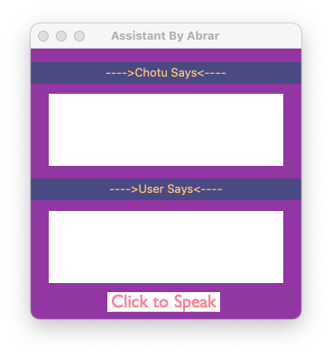
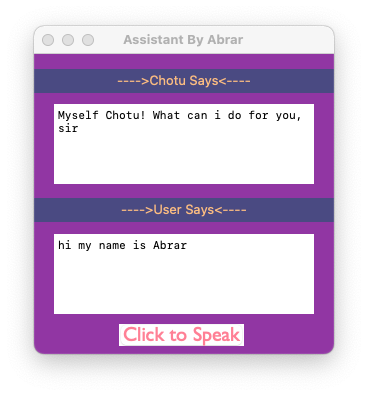
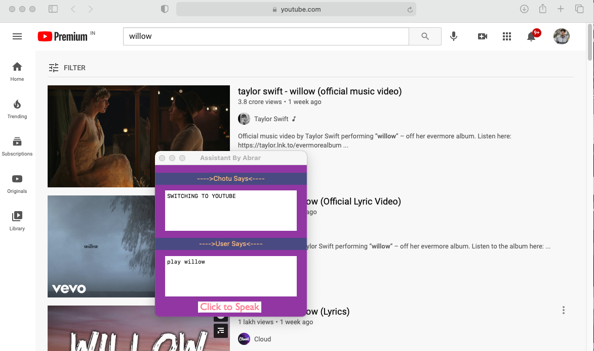

# Chotu_chat_bot

#### NOTE : IN THE LAST SECTION YOU'LL COME TO KNOW ABOUT THE BUGS IN THE PROGRAM.
## How to make it run ( commands to be used in cmd / terminal )
### --> You can download the folder from here : 

    git clone https://github.com/abraraltaf92/Chotu_chat_bot.git
    
### -->  Setting Up Your Virtual Environment :
  #### To activate it:  
    source {where you stored the folder}/venv/bin/activate
### --> Installing the Package
    pip3 install -r requirements.txt
### --> To run 
    python3 chotu.py
 
 
### Keywords to speak after making the program run error_free :

 
play --> youtube
 
ask questions --> wikipedia
 
search --> google
 
greetings like Hello --> will be replied by bot
 

## Images:

so far only this much ...... work in progress
 
# Problems:
## 1) If pyttsx3 is activated after completing its task the window gets destroyed(exit).
## 2) Also when pyttsx3 is working nothing can be inserted in textform fields.
